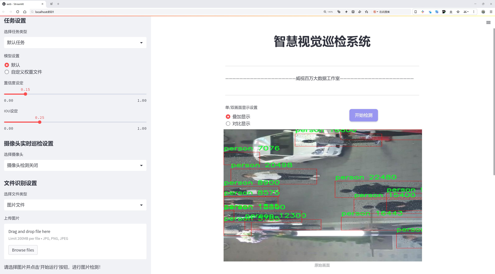

# 行人检测检测系统源码分享
 # [一条龙教学YOLOV8标注好的数据集一键训练_70+全套改进创新点发刊_Web前端展示]

### 1.研究背景与意义

项目参考[AAAI Association for the Advancement of Artificial Intelligence](https://gitee.com/qunmasj/projects)

项目来源[AACV Association for the Advancement of Computer Vision](https://github.com/qunshansj/good)

研究背景与意义

随着城市化进程的加快和智能监控技术的迅猛发展，行人检测作为计算机视觉领域的重要研究方向，受到了广泛关注。行人检测不仅在公共安全、交通管理、智能监控等领域具有重要应用价值，同时也是实现自动驾驶、智能机器人等高级人工智能系统的基础。近年来，深度学习技术的飞速发展为行人检测提供了新的解决方案，其中YOLO（You Only Look Once）系列模型因其高效性和实时性，成为了行人检测任务中的主流选择。

YOLOv8作为YOLO系列的最新版本，结合了更为先进的网络结构和优化算法，展现出更强的特征提取能力和更高的检测精度。然而，尽管YOLOv8在多种目标检测任务中表现优异，但在复杂场景下的行人检测仍面临诸多挑战，例如行人遮挡、光照变化、背景杂乱等问题。因此，基于YOLOv8的改进行人检测系统的研究显得尤为重要。

本研究将利用一个包含8833张图像的数据集进行行人检测的模型训练和评估。该数据集涵盖了7个类别，包括“头部”和“行人”等，能够为模型提供丰富的训练样本，帮助其学习到不同场景下行人的特征。这种多样化的数据集设计，不仅能够提高模型的泛化能力，还能增强其在实际应用中的鲁棒性。通过对数据集的深入分析和特征提取，研究将探索如何在YOLOv8的基础上进行改进，以提高行人检测的准确性和效率。

在技术层面，改进YOLOv8的行人检测系统将通过引入新的数据增强技术、优化损失函数以及调整网络结构等手段，提升模型在复杂环境下的表现。例如，利用图像翻转、旋转、缩放等数据增强方法，可以有效扩充训练数据集，提高模型对行人姿态变化的适应能力。同时，针对行人遮挡和背景复杂性的问题，研究将探讨多尺度特征融合和上下文信息利用等策略，以提升模型对行人目标的识别能力。

本研究的意义不仅在于提升行人检测的技术水平，更在于为实际应用提供可行的解决方案。随着智能城市建设的推进，行人检测系统的需求日益增加。通过改进YOLOv8的行人检测系统，可以为公共安全监控、交通流量分析、智能导航等领域提供更为精准和高效的技术支持，进而推动相关行业的发展。此外，研究成果还将为后续的行人检测研究提供参考，促进计算机视觉领域的进一步探索。

综上所述，基于改进YOLOv8的行人检测系统的研究，不仅具有重要的理论价值，更具备广泛的应用前景。通过对行人检测技术的深入研究和实践探索，期望能够为构建安全、智能的城市环境贡献一份力量。

### 2.图片演示




##### 注意：由于此博客编辑较早，上面“2.图片演示”和“3.视频演示”展示的系统图片或者视频可能为老版本，新版本在老版本的基础上升级如下：（实际效果以升级的新版本为准）

  （1）适配了YOLOV8的“目标检测”模型和“实例分割”模型，通过加载相应的权重（.pt）文件即可自适应加载模型。

  （2）支持“图片识别”、“视频识别”、“摄像头实时识别”三种识别模式。

  （3）支持“图片识别”、“视频识别”、“摄像头实时识别”三种识别结果保存导出，解决手动导出（容易卡顿出现爆内存）存在的问题，识别完自动保存结果并导出到tempDir中。

  （4）支持Web前端系统中的标题、背景图等自定义修改，后面提供修改教程。

  另外本项目提供训练的数据集和训练教程,暂不提供权重文件（best.pt）,需要您按照教程进行训练后实现图片演示和Web前端界面演示的效果。

### 3.视频演示

[3.1 视频演示](https://www.bilibili.com/video/BV1aGsKexE6M/?vd_source=ff015de2d29cbe2a9cdbfa7064407a08)

### 4.数据集信息展示

数据集信息展示

本数据集专为改进YOLOv8的行人检测系统而设计，旨在提升计算机视觉领域中行人识别的准确性和效率。该数据集包含8833幅图像，涵盖了七个不同的类别，这些类别分别为0、1、2、3、4、head和person。每个类别的设计都经过精心挑选，以确保能够全面覆盖行人检测中的各种场景和情况，从而为模型的训练提供丰富的样本。

在这8833幅图像中，涵盖了多种不同的环境和条件，包括城市街道、公共交通工具、商场和公园等场所。这种多样性使得数据集能够有效模拟现实世界中行人出现的各种情境，增强模型在实际应用中的适应能力。每幅图像都经过标注，确保每个类别的目标物体均被准确识别和定位，为YOLOv8模型的训练提供了高质量的训练数据。

数据集中包含的七个类别中，除了传统的行人类别（person）外，还特别增加了“head”类别，以便于模型在进行行人检测时能够更好地识别出行人的头部特征。这一设计旨在提高模型在复杂场景下的表现，尤其是在行人部分遮挡或视角不佳的情况下，能够通过头部特征进行有效的识别和定位。

数据集的使用遵循CC BY 4.0许可证，这意味着用户可以自由地使用、修改和分发数据集，只需在使用时给予适当的署名。这一开放的许可证鼓励了学术界和工业界的广泛应用，使得更多的研究者和开发者能够在此基础上进行创新和改进，推动行人检测技术的进步。

在进行YOLOv8模型的训练时，研究者可以利用该数据集进行多种实验，例如调整模型的超参数、优化网络结构以及探索不同的训练策略等。通过不断迭代和验证，研究者能够有效提升模型的性能，使其在真实场景中的行人检测能力达到新的高度。

此外，该数据集的设计还考虑到了数据的平衡性和多样性。每个类别的样本数量相对均衡，避免了因类别不平衡而导致的模型偏向性问题。这一特性使得模型在进行行人检测时，能够更好地适应不同类别的行人，减少误检和漏检的情况，提高整体检测精度。

综上所述，本数据集为行人检测系统的研究和开发提供了坚实的基础，凭借其丰富的图像样本和多样的类别设置，研究者能够在YOLOv8模型的训练中获得更为可靠和有效的结果。通过对该数据集的深入分析和应用，未来的行人检测技术将有望在准确性和实用性上实现显著突破。


### 5.全套项目环境部署视频教程（零基础手把手教学）

[5.1 环境部署教程链接（零基础手把手教学）](https://www.ixigua.com/7404473917358506534?logTag=c807d0cbc21c0ef59de5)


[5.2 安装Python虚拟环境创建和依赖库安装视频教程链接（零基础手把手教学）](https://www.ixigua.com/7404474678003106304?logTag=1f1041108cd1f708b01a)

### 6.手把手YOLOV8训练视频教程（零基础小白有手就能学会）

[6.1 环境部署教程链接（零基础手把手教学）](https://www.ixigua.com/7404477157818401292?logTag=d31a2dfd1983c9668658)

### 7.70+种全套YOLOV8创新点代码加载调参视频教程（一键加载写好的改进模型的配置文件）

[7.1 环境部署教程链接（零基础手把手教学）](https://www.ixigua.com/7404478314661806627?logTag=29066f8288e3f4eea3a4)

### 8.70+种全套YOLOV8创新点原理讲解（非科班也可以轻松写刊发刊，V10版本正在科研待更新）

由于篇幅限制，每个创新点的具体原理讲解就不一一展开，具体见下列网址中的创新点对应子项目的技术原理博客网址【Blog】：


[8.1 70+种全套YOLOV8创新点原理讲解链接](https://gitee.com/qunmasj/good)

### 9.系统功能展示（检测对象为举例，实际内容以本项目数据集为准）

图9.1.系统支持检测结果表格显示

  图9.2.系统支持置信度和IOU阈值手动调节

  图9.3.系统支持自定义加载权重文件best.pt(需要你通过步骤5中训练获得)

  图9.4.系统支持摄像头实时识别

  图9.5.系统支持图片识别

  图9.6.系统支持视频识别

  图9.7.系统支持识别结果文件自动保存

  图9.8.系统支持Excel导出检测结果数据


### 10.原始YOLOV8算法原理

原始YOLOv8算法原理

YOLOv8算法是目标检测领域的一次重要突破，作为YOLO系列的最新版本，它在检测精度和速度上均表现出色，充分体现了单阶段检测算法的优势。YOLOv8的架构设计围绕着四个主要部分展开：输入模块、Backbone骨干网络、Neck特征融合网络和Head检测模块。这种结构不仅提高了模型的灵活性和性能，还为目标检测任务提供了更为丰富的特征信息。

在输入模块中，YOLOv8首先对输入图像进行预处理。这一过程包括调整图像比例、实现Mosaic增强以及瞄点计算等步骤。Mosaic增强技术通过将多张图像拼接在一起，增加了训练数据的多样性，从而提高了模型的泛化能力。这种预处理方式使得YOLOv8能够更好地适应不同场景和目标，提高了其在复杂环境下的检测性能。

YOLOv8的Backbone部分采用了CSPDarknet结构，这一结构的创新之处在于引入了C2f模块替代了传统的C3模块。C2f模块通过将输入特征图分为两个分支，分别经过卷积层进行降维，最终再将这些分支堆叠融合，形成更高维度的特征图。这种设计不仅提升了特征提取的效率，还有效保留了梯度流动信息，确保了模型在训练过程中的稳定性和收敛速度。此外，YOLOv8还使用了快速空间金字塔池化（SPPF）模块，对输出特征图进行处理，通过不同内核尺寸的池化操作合并特征图，进一步丰富了特征信息。

在Neck部分，YOLOv8依然采用“双塔结构”，结合了特征金字塔网络（FPN）和路径聚合网络（PAN）。这种结构促进了语义特征和定位特征之间的有效转移，增强了网络对不同尺度目标的检测能力。通过多层卷积和池化操作，Neck部分能够有效地处理和压缩特征图，使得最终的检测结果更加准确。

YOLOv8的Head检测模块则是其核心部分，采用了解耦头的结构进行目标检测。与传统的检测方式不同，YOLOv8将回归分支和预测分支进行了分离，这一创新设计加速了模型的收敛过程，并提高了检测的准确性。该模块通过多个Detect检测器的组合，能够高效地处理不同类别和尺度的目标，确保在复杂场景下的检测性能。

值得一提的是，YOLOv8在目标检测过程中采用了无锚框（Anchor-Free）的方法。这一策略使得模型能够直接预测目标的中心点及其宽高比例，减少了对Anchor框的依赖，从而提高了检测速度和准确度。这种设计不仅简化了模型的复杂性，还使得YOLOv8在处理小目标和密集目标时表现得更加出色。

YOLOv8的创新设计使其在目标检测领域达到了新的高度。通过结合之前YOLO系列模型的优点，YOLOv8在Head标签分配和Loss计算方面的改进，使得模型在训练和推理过程中更加高效。此外，YOLOv8还引入了先进的优化算法，进一步提升了模型的性能和灵活性。这些改进不仅为目标检测任务提供了更为强大的工具，也为相关应用场景的实现奠定了基础。

总的来说，YOLOv8算法通过其独特的结构设计和创新的技术手段，成功地提升了目标检测的精度和速度。其在特征提取、特征融合和目标检测等方面的优化，使得YOLOv8在各种复杂场景下都能保持优异的表现。这一系列的改进不仅推动了目标检测技术的发展，也为实际应用提供了更多可能性，尤其是在自动化和智能化的领域中，YOLOv8无疑将发挥重要的作用。随着YOLOv8的广泛应用，我们有理由相信，它将为目标检测领域带来新的冲击和机遇。


### 11.项目核心源码讲解（再也不用担心看不懂代码逻辑）

#### 11.1 ui.py

以下是经过精简和注释的核心代码部分：

```python
import sys
import subprocess
from QtFusion.path import abs_path

def run_script(script_path):
    """
    使用当前 Python 环境运行指定的脚本。

    Args:
        script_path (str): 要运行的脚本路径
    """
    # 获取当前 Python 解释器的路径
    python_path = sys.executable

    # 构建运行命令，使用 streamlit 运行指定的脚本
    command = f'"{python_path}" -m streamlit run "{script_path}"'

    # 执行命令，并等待其完成
    result = subprocess.run(command, shell=True)
    
    # 检查命令执行结果，如果返回码不为0，表示出错
    if result.returncode != 0:
        print("脚本运行出错。")

# 主程序入口
if __name__ == "__main__":
    # 获取要运行的脚本的绝对路径
    script_path = abs_path("web.py")

    # 调用函数运行脚本
    run_script(script_path)
```

### 代码注释说明：
1. **导入模块**：
   - `sys`：用于获取当前 Python 解释器的路径。
   - `subprocess`：用于执行外部命令。
   - `abs_path`：从 `QtFusion.path` 导入的函数，用于获取文件的绝对路径。

2. **`run_script` 函数**：
   - 该函数接受一个脚本路径作为参数，并使用当前 Python 环境运行该脚本。
   - 首先，通过 `sys.executable` 获取当前 Python 解释器的路径。
   - 然后，构建一个命令字符串，使用 `streamlit` 模块运行指定的脚本。
   - 使用 `subprocess.run` 执行命令，并等待其完成。
   - 检查命令的返回码，如果不为0，则打印错误信息。

3. **主程序入口**：
   - 通过 `if __name__ == "__main__":` 确保只有在直接运行该脚本时才会执行以下代码。
   - 获取要运行的脚本 `web.py` 的绝对路径。
   - 调用 `run_script` 函数，传入脚本路径以执行该脚本。

这个文件名为 `ui.py`，它的主要功能是运行一个指定的 Python 脚本，具体来说是使用 Streamlit 框架来启动一个 Web 应用。代码中首先导入了必要的模块，包括 `sys`、`os` 和 `subprocess`，这些模块分别用于访问系统参数、文件路径和执行外部命令。

在 `run_script` 函数中，首先获取当前 Python 解释器的路径，这通过 `sys.executable` 实现。接着，构建一个命令字符串，该命令用于在命令行中运行指定的脚本。命令的格式是 `python -m streamlit run "script_path"`，其中 `script_path` 是传入的参数，表示要运行的脚本的路径。

然后，使用 `subprocess.run` 方法执行这个命令。这个方法会在新的 shell 中运行命令，并等待其完成。执行完命令后，检查返回码，如果返回码不为零，表示脚本运行出错，程序会打印出错误信息。

在文件的最后部分，使用 `if __name__ == "__main__":` 语句来确保只有在直接运行这个文件时才会执行后面的代码。这里指定了要运行的脚本路径为 `web.py`，并调用 `run_script` 函数来执行这个脚本。

整体来看，这个文件的作用是提供一个简单的接口来启动一个基于 Streamlit 的 Web 应用，用户只需指定脚本路径，程序就会自动处理运行的细节。

#### 11.2 ultralytics\models\yolo\pose\__init__.py

以下是代码中最核心的部分，并附上详细的中文注释：

```python
# 导入所需的模块
from .predict import PosePredictor  # 导入姿态预测器类
from .train import PoseTrainer      # 导入姿态训练器类
from .val import PoseValidator       # 导入姿态验证器类

# 定义模块的公开接口
__all__ = "PoseTrainer", "PoseValidator", "PosePredictor"  # 指定在使用 'from module import *' 时，公开的类
```

### 代码注释说明：
1. **导入模块**：
   - `from .predict import PosePredictor`：从当前包的 `predict` 模块中导入 `PosePredictor` 类，该类用于进行姿态预测。
   - `from .train import PoseTrainer`：从当前包的 `train` 模块中导入 `PoseTrainer` 类，该类用于训练姿态模型。
   - `from .val import PoseValidator`：从当前包的 `val` 模块中导入 `PoseValidator` 类，该类用于验证姿态模型的性能。

2. **定义公开接口**：
   - `__all__` 是一个特殊变量，用于定义在使用 `from module import *` 时，哪些类或函数是可以被导入的。在这里，`PoseTrainer`、`PoseValidator` 和 `PosePredictor` 被指定为模块的公开接口，意味着它们是模块的主要功能部分。

这个程序文件是Ultralytics YOLO项目中的一个模块，专注于姿态估计（Pose Estimation）。文件的第一行是一个注释，表明该项目使用的是AGPL-3.0许可证，并且提到了Ultralytics YOLO的名称，表明这是一个与YOLO（You Only Look Once）相关的项目，主要用于目标检测和姿态估计等计算机视觉任务。

接下来的几行代码通过相对导入的方式引入了三个类：`PosePredictor`、`PoseTrainer`和`PoseValidator`。这些类分别负责姿态估计的不同方面。`PosePredictor`可能用于进行姿态预测，`PoseTrainer`用于训练模型，而`PoseValidator`则用于验证模型的性能。

最后一行代码定义了`__all__`变量，这是一个特殊的变量，用于指定当使用`from module import *`语句时，哪些名称会被导入。在这里，`__all__`包含了三个类的名称，表明这三个类是该模块的公共接口，用户可以直接使用它们。

总体而言，这个文件的主要功能是组织和导出与姿态估计相关的功能模块，方便其他部分的代码进行调用和使用。

#### 11.3 ultralytics\engine\model.py

以下是代码中最核心的部分，并附上详细的中文注释：

```python
class Model(nn.Module):
    """
    统一所有模型API的基础类。

    参数:
        model (str, Path): 要加载或创建的模型文件路径。
        task (Any, optional): YOLO模型的任务类型。默认为None。

    属性:
        predictor (Any): 预测器对象。
        model (Any): 模型对象。
        trainer (Any): 训练器对象。
        task (str): 模型任务类型。
        ckpt (Any): 如果模型是从*.pt文件加载的，则为检查点对象。
        cfg (str): 如果从*.yaml文件加载，则为模型配置。
        ckpt_path (str): 检查点文件路径。
        overrides (dict): 训练器对象的覆盖参数。
        metrics (Any): 训练/验证指标数据。
    """

    def __init__(self, model: Union[str, Path] = "yolov8n.pt", task=None, verbose=False) -> None:
        """
        初始化YOLO模型。

        参数:
            model (Union[str, Path], optional): 要加载或创建的模型路径或名称。默认为'yolov8n.pt'。
            task (Any, optional): YOLO模型的任务类型。默认为None。
            verbose (bool, optional): 是否启用详细模式。
        """
        super().__init__()
        self.predictor = None  # 预测器对象
        self.model = None  # 模型对象
        self.trainer = None  # 训练器对象
        self.task = task  # 任务类型
        self.model_name = model = str(model).strip()  # 去除模型名称的空格

        # 检查是否为Ultralytics HUB模型
        if self.is_hub_model(model):
            self.session = self._get_hub_session(model)  # 获取HUB会话
            model = self.session.model_file  # 从HUB获取模型文件

        # 加载或创建新的YOLO模型
        model = checks.check_model_file_from_stem(model)  # 添加后缀，例如yolov8n -> yolov8n.pt
        if Path(model).suffix in (".yaml", ".yml"):
            self._new(model, task=task, verbose=verbose)  # 从配置文件创建新模型
        else:
            self._load(model, task=task)  # 从权重文件加载模型

        self.model_name = model  # 更新模型名称

    def predict(self, source=None, stream=False, predictor=None, **kwargs):
        """
        使用YOLO模型进行预测。

        参数:
            source (str | int | PIL | np.ndarray): 要进行预测的图像源。
            stream (bool): 是否流式传输预测结果。默认为False。
            predictor (BasePredictor): 自定义预测器。
            **kwargs : 传递给预测器的其他关键字参数。

        返回:
            (List[ultralytics.engine.results.Results]): 预测结果列表。
        """
        if source is None:
            source = ASSETS  # 如果没有提供源，则使用默认资产
            LOGGER.warning(f"WARNING ⚠️ 'source' is missing. Using 'source={source}'.")

        # 检查是否为命令行接口
        is_cli = (sys.argv[0].endswith("yolo") or sys.argv[0].endswith("ultralytics")) and any(
            x in sys.argv for x in ("predict", "track", "mode=predict", "mode=track")
        )

        custom = {"conf": 0.25, "save": is_cli}  # 方法默认参数
        args = {**self.overrides, **custom, **kwargs, "mode": "predict"}  # 右侧参数优先级最高

        if not self.predictor:
            self.predictor = predictor or self._smart_load("predictor")(overrides=args, _callbacks=self.callbacks)
            self.predictor.setup_model(model=self.model, verbose=is_cli)  # 设置预测器模型
        else:  # 仅在预测器已设置时更新参数
            self.predictor.args = get_cfg(self.predictor.args, args)

        return self.predictor.predict_cli(source=source) if is_cli else self.predictor(source=source, stream=stream)

    def _load(self, weights: str, task=None):
        """
        从权重文件加载模型并推断任务类型。

        参数:
            weights (str): 要加载的模型检查点。
            task (str | None): 模型任务。
        """
        suffix = Path(weights).suffix
        if suffix == ".pt":
            self.model, self.ckpt = attempt_load_one_weight(weights)  # 加载权重
            self.task = self.model.args["task"]  # 推断任务类型
        else:
            weights = checks.check_file(weights)  # 检查文件有效性
            self.model, self.ckpt = weights, None
            self.task = task or guess_model_task(weights)  # 推断任务类型
        self.ckpt_path = weights  # 更新检查点路径

    def is_hub_model(self, model):
        """检查提供的模型是否为HUB模型。"""
        return any(
            (
                model.startswith(f"{HUB_WEB_ROOT}/models/"),  # HUB模型URL
                [len(x) for x in model.split("_")] == [42, 20],  # APIKEY_MODELID
                len(model) == 20 and not Path(model).exists() and all(x not in model for x in "./\\"),  # MODELID
            )
        )

    def _get_hub_session(self, model: str):
        """为Hub训练创建会话。"""
        from ultralytics.hub.session import HUBTrainingSession

        session = HUBTrainingSession(model)
        return session if session.client.authenticated else None  # 返回会话对象

    # 其他方法省略
```

以上代码展示了YOLO模型的基本结构和核心功能，包括模型的初始化、预测、加载权重等。每个方法都附有详细的中文注释，解释其功能和参数。

这个程序文件是Ultralytics YOLO（You Only Look Once）模型的一个核心部分，主要定义了一个名为`Model`的类，该类用于统一所有YOLO模型的API。这个类的构造函数和方法提供了模型的加载、预测、训练、验证等功能。

在初始化`Model`类时，可以传入模型文件的路径（可以是字符串或Path对象）和任务类型。构造函数首先调用父类的初始化方法，然后设置了一些属性，包括回调函数、预测器、模型对象、训练器、检查点等。接着，它会检查传入的模型是否来自Ultralytics HUB或Triton Server，如果是，则相应地处理。最后，根据模型文件的后缀（.yaml或.pt）来加载或创建新的YOLO模型。

`Model`类提供了多种方法，其中包括：

- `__call__`：重载了调用运算符，使得可以直接调用模型对象进行预测。
- `_new`和`_load`：分别用于初始化新模型和加载已有模型。
- `predict`：执行模型的预测功能，接受多种类型的输入源（如文件路径、图像数组等），并返回预测结果。
- `train`：用于训练模型，接受训练配置参数。
- `val`：用于在给定数据集上验证模型的性能。
- `export`：将模型导出为其他格式。
- `track`：实现对象跟踪功能。

此外，类中还包含了一些静态方法和属性，用于检查模型类型、获取设备信息、管理回调函数等。`task_map`属性用于映射任务到相应的模型、训练器、验证器和预测器类，但在当前实现中并未提供具体的映射。

总的来说，这个文件的主要功能是提供一个灵活的接口，使得用户可以方便地加载、训练和使用YOLO模型进行各种计算机视觉任务。通过封装复杂的逻辑，用户可以更专注于模型的应用，而不必深入了解底层实现细节。

#### 11.4 train.py

以下是经过简化并注释的核心代码部分：

```python
import os
import torch
import yaml
from ultralytics import YOLO  # 导入YOLO模型库
from QtFusion.path import abs_path  # 导入路径处理函数

# 确定使用的设备，如果有可用的GPU则使用GPU，否则使用CPU
device = "0" if torch.cuda.is_available() else "cpu"

if __name__ == '__main__':  # 确保该模块被直接运行时才执行以下代码
    # 设置训练参数
    workers = 1  # 数据加载的工作进程数
    batch = 2    # 每个批次的样本数量

    # 数据集名称
    data_name = "data"
    # 获取数据集配置文件的绝对路径
    data_path = abs_path(f'datasets/{data_name}/{data_name}.yaml', path_type='current')
    
    # 获取数据集目录路径
    directory_path = os.path.dirname(data_path)
    
    # 读取YAML配置文件
    with open(data_path, 'r') as file:
        data = yaml.load(file, Loader=yaml.FullLoader)
    
    # 如果YAML文件中包含'path'项，则修改为当前目录路径
    if 'path' in data:
        data['path'] = directory_path
        # 将修改后的数据写回YAML文件
        with open(data_path, 'w') as file:
            yaml.safe_dump(data, file, sort_keys=False)

    # 加载YOLOv8模型配置
    model = YOLO(model='./ultralytics/cfg/models/v8/yolov8s.yaml', task='detect')
    
    # 开始训练模型
    results2 = model.train(
        data=data_path,  # 指定训练数据的配置文件路径
        device=device,   # 使用指定的设备进行训练
        workers=workers, # 使用的工作进程数
        imgsz=640,       # 输入图像的大小
        epochs=100,     # 训练的轮数
        batch=batch,     # 每个批次的大小
        name='train_v8_' + data_name  # 训练任务的名称
    )
```

### 代码注释说明：
1. **导入库**：导入必要的库，包括操作系统、PyTorch、YAML处理库和YOLO模型库。
2. **设备选择**：根据是否有可用的GPU来选择使用的设备（GPU或CPU）。
3. **主程序入口**：使用`if __name__ == '__main__':`确保代码仅在直接运行时执行。
4. **训练参数设置**：定义数据加载的工作进程数和每个批次的样本数量。
5. **数据集路径处理**：构建数据集配置文件的绝对路径，并获取其目录路径。
6. **读取和修改YAML文件**：读取YAML文件内容，如果存在`path`项，则更新为当前目录路径，并将修改后的内容写回文件。
7. **模型加载**：加载YOLOv8模型的配置文件。
8. **模型训练**：调用模型的训练方法，传入必要的参数，包括数据路径、设备、工作进程数、图像大小、训练轮数和批次大小等。

这个程序文件 `train.py` 是一个用于训练 YOLOv8 模型的脚本。首先，它导入了必要的库，包括 `os`、`torch`、`yaml` 和 `ultralytics` 中的 YOLO 模型。接着，程序会根据系统是否支持 CUDA 来选择设备，如果支持则使用 GPU（设备编号为 "0"），否则使用 CPU。

在 `if __name__ == '__main__':` 语句下，程序确保只有在直接运行该脚本时才会执行以下代码。首先定义了工作进程数 `workers` 和批次大小 `batch`，并设置数据集名称为 "data"。然后，通过 `abs_path` 函数构建数据集 YAML 文件的绝对路径，并将路径中的分隔符替换为 Unix 风格的分隔符。

接下来，程序获取数据集的目录路径，并打开 YAML 文件以读取数据。使用 `yaml.load` 函数加载 YAML 文件内容，并保持原有顺序。若 YAML 数据中包含 `path` 项，则将其修改为当前目录路径，并将更新后的数据写回到 YAML 文件中。

随后，程序加载预训练的 YOLOv8 模型，指定模型配置文件的路径。接着，调用 `model.train` 方法开始训练模型，传入训练数据的配置文件路径、设备、工作进程数、输入图像大小（640x640）、训练的 epoch 数（100）以及批次大小（2）。最后，指定训练任务的名称，以便于后续的识别和管理。

整体来看，这个脚本的主要功能是配置和启动 YOLOv8 模型的训练过程，确保数据集路径正确，并设置相关的训练参数。

#### 11.5 ultralytics\utils\callbacks\dvc.py

以下是经过简化和注释的核心代码部分，主要功能是使用DVCLive进行训练过程中的日志记录。

```python
# 导入必要的库
from ultralytics.utils import LOGGER, SETTINGS, TESTS_RUNNING, checks

try:
    # 确保当前不是在测试环境中
    assert not TESTS_RUNNING  
    # 确保DVC集成已启用
    assert SETTINGS["dvc"] is True  
    import dvclive  # 导入DVCLive库

    # 检查DVCLive版本
    assert checks.check_version("dvclive", "2.11.0", verbose=True)

    import os
    import re
    from pathlib import Path

    # 初始化DVCLive日志记录实例
    live = None
    _processed_plots = {}  # 用于存储已处理的图表

    # 标志变量，指示当前是否为训练的最后一个epoch
    _training_epoch = False

except (ImportError, AssertionError, TypeError):
    dvclive = None  # 如果导入失败，则将dvclive设置为None


def _log_images(path, prefix=""):
    """记录指定路径的图像，使用DVCLive进行日志记录。"""
    if live:  # 如果DVCLive实例存在
        name = path.name
        # 通过批次分组图像，以便在UI中启用滑块
        m = re.search(r"_batch(\d+)", name)
        if m:
            ni = m[1]
            new_stem = re.sub(r"_batch(\d+)", "_batch", path.stem)
            name = (Path(new_stem) / ni).with_suffix(path.suffix)

        live.log_image(os.path.join(prefix, name), path)  # 记录图像


def on_pretrain_routine_start(trainer):
    """在预训练例程开始时初始化DVCLive日志记录器。"""
    try:
        global live
        live = dvclive.Live(save_dvc_exp=True, cache_images=True)  # 创建DVCLive实例
        LOGGER.info("DVCLive is detected and auto logging is enabled.")  # 日志记录启用信息
    except Exception as e:
        LOGGER.warning(f"WARNING ⚠️ DVCLive installed but not initialized correctly: {e}")  # 初始化失败警告


def on_train_start(trainer):
    """如果DVCLive日志记录处于活动状态，则记录训练参数。"""
    if live:
        live.log_params(trainer.args)  # 记录训练参数


def on_fit_epoch_end(trainer):
    """在每个训练epoch结束时记录训练指标和模型信息。"""
    global _training_epoch
    if live and _training_epoch:  # 如果DVCLive存在且当前为训练epoch
        all_metrics = {**trainer.label_loss_items(trainer.tloss, prefix="train"), **trainer.metrics, **trainer.lr}
        for metric, value in all_metrics.items():
            live.log_metric(metric, value)  # 记录所有指标

        _log_images(trainer.plots, "train")  # 记录训练图表
        live.next_step()  # 进入下一个步骤
        _training_epoch = False  # 重置训练epoch标志


def on_train_end(trainer):
    """在训练结束时记录最佳指标、图表和混淆矩阵。"""
    if live:
        all_metrics = {**trainer.label_loss_items(trainer.tloss, prefix="train"), **trainer.metrics, **trainer.lr}
        for metric, value in all_metrics.items():
            live.log_metric(metric, value, plot=False)  # 记录最佳指标

        live.end()  # 结束日志记录


# 定义回调函数，如果DVCLive可用，则注册相关的回调
callbacks = (
    {
        "on_pretrain_routine_start": on_pretrain_routine_start,
        "on_train_start": on_train_start,
        "on_fit_epoch_end": on_fit_epoch_end,
        "on_train_end": on_train_end,
    }
    if dvclive
    else {}
)
```

### 代码说明：
1. **导入模块**：导入必要的模块和库，确保DVC集成和DVCLive的可用性。
2. **日志记录功能**：通过`_log_images`函数记录图像，`on_pretrain_routine_start`函数初始化DVCLive日志记录器。
3. **训练过程中的回调**：定义多个回调函数以在训练的不同阶段记录参数、指标和图表。
4. **全局变量**：使用全局变量来跟踪训练状态（如是否在训练epoch中）。
5. **条件检查**：在每个回调中检查DVCLive实例是否存在，以决定是否执行日志记录。

这个程序文件是Ultralytics YOLO项目中的一个回调模块，主要用于集成DVCLive库，以便在训练过程中记录和可视化训练的各种指标和状态。文件的开头部分导入了一些必要的模块和库，并进行了一些基本的检查，确保在运行时DVCLive库可用且设置正确。

在尝试导入DVCLive库后，程序定义了一些全局变量，例如`live`（用于存储DVCLive的实例）和`_processed_plots`（用于跟踪已处理的图像）。同时，定义了一个标志`_training_epoch`，用于区分训练的每个epoch。

接下来的几个函数主要负责记录不同类型的数据。`_log_images`函数用于记录图像，`_log_plots`函数用于记录训练过程中的图像和图表，`_log_confusion_matrix`函数则用于记录混淆矩阵，以便分析模型的分类性能。

在训练的不同阶段，程序会调用相应的回调函数。例如，`on_pretrain_routine_start`函数在预训练开始时初始化DVCLive记录器，并记录相关信息；`on_train_start`函数在训练开始时记录训练参数；`on_fit_epoch_end`函数在每个训练epoch结束时记录训练指标和模型信息，并更新到DVCLive中；`on_train_end`函数在训练结束时记录最佳指标、图表和混淆矩阵。

最后，程序将所有的回调函数整理成一个字典，只有在DVCLive可用的情况下才会使用这些回调。这种设计使得代码具有良好的灵活性和可扩展性，能够在不同的训练场景中有效地记录和可视化训练过程中的各种信息。

#### 11.6 ultralytics\utils\tuner.py

以下是经过简化和注释的核心代码部分，主要关注超参数调优的实现逻辑：

```python
import subprocess
from ultralytics.utils import LOGGER, NUM_THREADS
from ray import tune
from ray.air import RunConfig
from ray.tune.schedulers import ASHAScheduler
from ray.air.integrations.wandb import WandbLoggerCallback

def run_ray_tune(model, space: dict = None, grace_period: int = 10, gpu_per_trial: int = None, max_samples: int = 10, **train_args):
    """
    使用Ray Tune进行超参数调优。

    参数:
        model (YOLO): 要进行调优的模型。
        space (dict, optional): 超参数搜索空间。默认为None。
        grace_period (int, optional): ASHA调度器的宽限期（以epoch为单位）。默认为10。
        gpu_per_trial (int, optional): 每个试验分配的GPU数量。默认为None。
        max_samples (int, optional): 最大试验次数。默认为10。
        train_args (dict, optional): 传递给`train()`方法的其他参数。默认为{}。

    返回:
        (dict): 包含超参数搜索结果的字典。
    """

    # 日志信息，提示用户了解Ray Tune
    LOGGER.info("💡 Learn about RayTune at https://docs.ultralytics.com/integrations/ray-tune")

    # 安装Ray Tune库
    subprocess.run("pip install ray[tune]".split(), check=True)

    # 定义默认的超参数搜索空间
    default_space = {
        "lr0": tune.uniform(1e-5, 1e-1),  # 初始学习率
        "lrf": tune.uniform(0.01, 1.0),   # 最终学习率
        "momentum": tune.uniform(0.6, 0.98),  # 动量
        "weight_decay": tune.uniform(0.0, 0.001),  # 权重衰减
        # 其他超参数...
    }

    # 将模型放入Ray存储中
    model_in_store = ray.put(model)

    def _tune(config):
        """
        使用指定的超参数训练YOLO模型。

        参数:
            config (dict): 用于训练的超参数字典。

        返回:
            None.
        """
        model_to_train = ray.get(model_in_store)  # 从Ray存储中获取模型
        model_to_train.reset_callbacks()  # 重置回调
        config.update(train_args)  # 更新超参数
        results = model_to_train.train(**config)  # 训练模型
        return results.results_dict  # 返回结果字典

    # 获取搜索空间
    if not space:
        space = default_space  # 如果未提供搜索空间，则使用默认空间

    # 定义可训练函数并分配资源
    trainable_with_resources = tune.with_resources(_tune, {"cpu": NUM_THREADS, "gpu": gpu_per_trial or 0})

    # 定义ASHA调度器
    asha_scheduler = ASHAScheduler(
        time_attr="epoch",
        metric="metric_name",  # 需要替换为实际的度量名称
        mode="max",
        max_t=train_args.get("epochs", 100),  # 最大训练epoch
        grace_period=grace_period,
        reduction_factor=3,
    )

    # 定义Ray Tune超参数搜索调优器
    tuner = tune.Tuner(
        trainable_with_resources,
        param_space=space,
        tune_config=tune.TuneConfig(scheduler=asha_scheduler, num_samples=max_samples),
        run_config=RunConfig(callbacks=[WandbLoggerCallback(project="YOLOv8-tune")]),
    )

    # 运行超参数搜索
    tuner.fit()

    # 返回超参数搜索的结果
    return tuner.get_results()
```

### 代码注释说明：
1. **导入必要的库**：导入了`subprocess`用于安装依赖，导入了Ray Tune相关的模块用于超参数调优。
2. **`run_ray_tune`函数**：这是进行超参数调优的主要函数，接受模型和调优参数。
3. **安装Ray Tune**：使用`subprocess.run`安装Ray Tune库。
4. **定义超参数搜索空间**：设置了多个超参数的搜索范围。
5. **模型存储**：将模型放入Ray的存储中，以便在调优过程中使用。
6. **训练函数`_tune`**：定义了一个内部函数，用于训练模型并返回结果。
7. **获取搜索空间**：如果未提供搜索空间，则使用默认的搜索空间。
8. **定义调度器和调优器**：设置ASHA调度器以管理超参数搜索的进程，并定义调优器的配置。
9. **运行调优**：调用`tuner.fit()`开始超参数搜索，并返回结果。

这个程序文件是一个用于超参数调优的工具，特别是针对Ultralytics YOLO模型的。文件的主要功能是通过Ray Tune库来优化YOLO模型的训练超参数，以提高模型的性能。

首先，程序导入了一些必要的模块，包括`subprocess`用于执行系统命令，`TASK2DATA`和`TASK2METRIC`等配置项用于处理任务相关的数据和指标，`DEFAULT_CFG`和`LOGGER`等用于日志记录和默认配置的管理。

`run_ray_tune`函数是该文件的核心，接受多个参数，包括要调优的模型、超参数搜索空间、每个试验的GPU数量、最大样本数等。函数的主要任务是设置并运行超参数调优的过程。

在函数内部，首先记录一条信息，提示用户可以查看Ray Tune的文档。接着，程序尝试安装Ray Tune库，如果未能成功导入，则抛出异常。随后，程序还尝试导入`wandb`库，用于记录实验的结果。

接下来，定义了一个默认的超参数搜索空间，包含了一系列超参数的范围，例如学习率、动量、权重衰减等。这些超参数对模型的训练过程和最终性能有着重要影响。

然后，程序将模型放入Ray的存储中，以便在调优过程中可以方便地访问。定义了一个内部函数`_tune`，该函数根据传入的超参数配置训练YOLO模型，并返回训练结果。

在获取超参数搜索空间时，如果用户没有提供自定义的搜索空间，则使用默认的搜索空间，并记录警告信息。接着，程序从训练参数中获取数据集的信息，并确保数据集的正确性。

定义了一个可训练的函数，并为其分配了计算资源。接着，使用ASHAScheduler定义了超参数搜索的调度器，该调度器可以根据训练过程中的性能动态调整超参数的选择。

如果用户使用了`wandb`，则定义了相应的回调函数，用于记录实验结果。然后，创建了Ray Tune的超参数搜索调优器，并指定了超参数空间、调度器、样本数量等配置。

最后，调用`tuner.fit()`开始超参数搜索，并返回搜索结果。这些结果将帮助用户找到最佳的超参数配置，从而提高YOLO模型的训练效果。整体上，这个文件为YOLO模型的超参数调优提供了一个灵活且高效的解决方案。

### 12.系统整体结构（节选）

### 整体功能和构架概括

Ultralytics YOLO项目是一个用于目标检测、姿态估计、图像分类和分割等计算机视觉任务的框架。该项目的整体架构围绕着模型的训练、预测和评估，提供了一系列工具和模块来简化这些过程。项目主要包括以下几个方面：

1. **模型定义与管理**：通过`model.py`和其他相关模块，定义了YOLO模型的结构和功能，支持多种任务（如目标检测、姿态估计等）。

2. **训练与验证**：`train.py`负责模型的训练过程，配置训练参数并启动训练。`dvc.py`和`wb.py`等回调模块用于记录训练过程中的指标和状态，便于后续分析。

3. **超参数调优**：`tuner.py`提供了超参数调优的功能，利用Ray Tune库自动优化模型的超参数，以提高模型性能。

4. **用户界面**：`ui.py`提供了一个简单的用户界面，允许用户通过命令行启动Streamlit应用，方便进行模型的可视化和交互。

5. **数据处理与探索**：通过数据模块（如`explorer/__init__.py`），用户可以方便地管理和探索数据集。

6. **多任务支持**：项目支持多种计算机视觉任务，包括目标检测、姿态估计、图像分类和分割，模块化设计使得不同任务的实现相对独立。

### 文件功能整理表

| 文件路径                                         | 功能描述                                                                                   |
|--------------------------------------------------|--------------------------------------------------------------------------------------------|
| `ui.py`                                         | 提供一个用户界面，通过Streamlit启动Web应用，方便用户与模型进行交互和可视化。            |
| `ultralytics/models/yolo/pose/__init__.py`     | 导出姿态估计相关的类（如`PosePredictor`、`PoseTrainer`、`PoseValidator`），用于姿态估计任务。 |
| `ultralytics/engine/model.py`                  | 定义`Model`类，提供模型的加载、训练、预测和验证等功能，统一YOLO模型的API。             |
| `train.py`                                      | 配置和启动YOLOv8模型的训练过程，设置训练参数和数据集路径。                              |
| `ultralytics/utils/callbacks/dvc.py`           | 集成DVCLive库，记录和可视化训练过程中的指标和状态。                                      |
| `ultralytics/utils/tuner.py`                    | 提供超参数调优功能，利用Ray Tune库自动优化模型的超参数。                                 |
| `ultralytics/data/explorer/__init__.py`        | 提供数据集管理和探索的功能，方便用户查看和处理数据集。                                   |
| `ultralytics/models/yolo/classify/predict.py`  | 实现YOLO模型的图像分类预测功能，处理输入并返回分类结果。                                 |
| `ultralytics/models/yolo/segment/train.py`     | 负责YOLO模型的图像分割训练过程，配置训练参数并启动训练。                                |
| `ultralytics/utils/callbacks/wb.py`            | 集成Weights & Biases，记录实验结果和训练过程中的指标，便于后续分析和可视化。           |

这个表格总结了项目中各个文件的主要功能，展示了Ultralytics YOLO项目的模块化设计和多任务支持的特点。

注意：由于此博客编辑较早，上面“11.项目核心源码讲解（再也不用担心看不懂代码逻辑）”中部分代码可能会优化升级，仅供参考学习，完整“训练源码”、“Web前端界面”和“70+种创新点源码”以“13.完整训练+Web前端界面+70+种创新点源码、数据集获取”的内容为准。

### 13.完整训练+Web前端界面+70+种创新点源码、数据集获取


https://mbd.pub/o/bread/ZpqWlZhu

